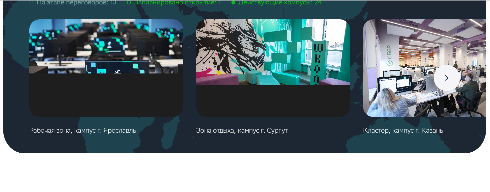
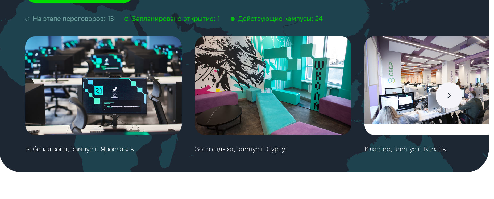
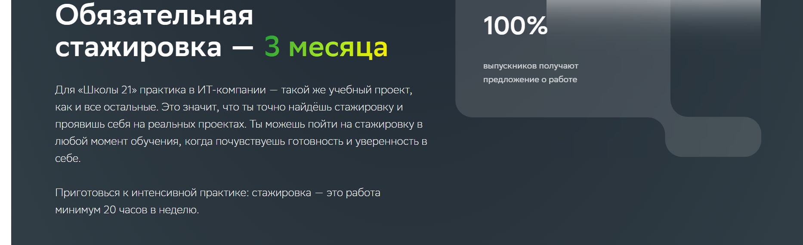
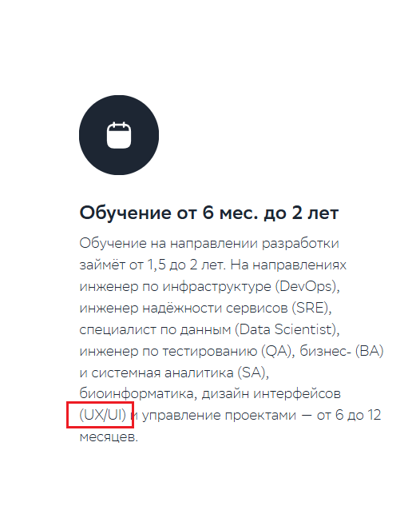
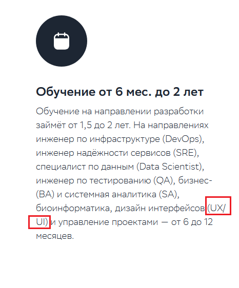
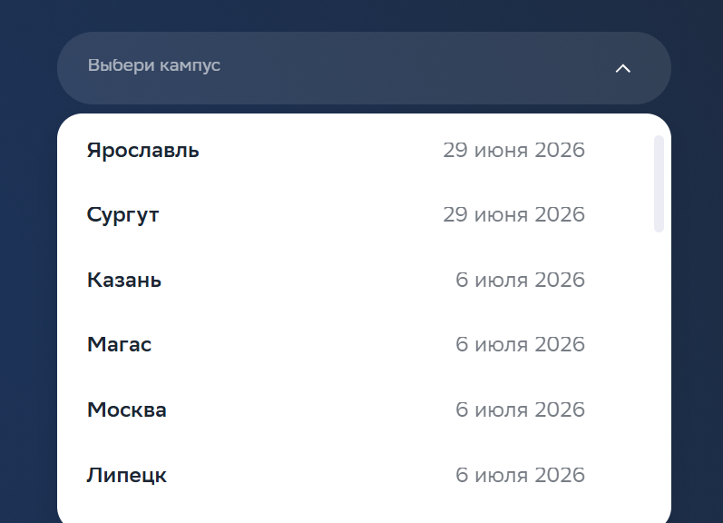
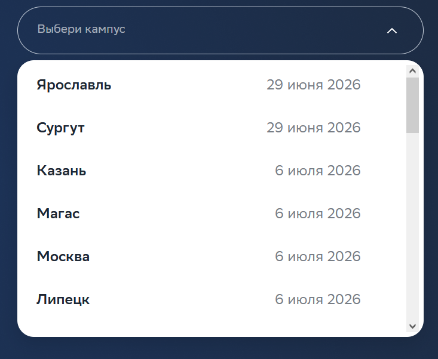
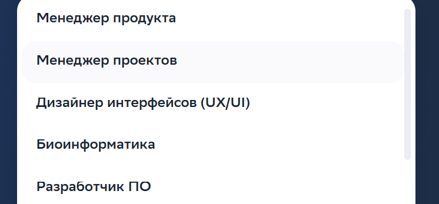
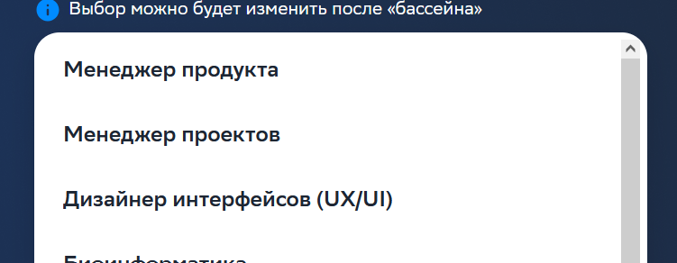

## Движки браузеров

| Проверяемый элемент | Конкретное отличие (что различается и в каких браузерах) | Предполагаемая техническая причина отличия | Номер/название скриншотов, где видны отличия в отображении элементов |
|:--------------------|:---------------------------------------------------------|:-------------------------------------------|:--------------------------------------------------------------------:|
| Изображения кампусов под картой | Загрузка изображений в браузерах Chrome и Microsoft Edge происходит с черным фоном   В FireFox загрузка происходила на белом фоне | Разный background-color у картинки в коде. Скорее всего это задано у браузера по умолчанию, если разработчик не указал  | 1 |
| Виджет "100 % выпускников получают предложение о работе" | В браузерах Microsoft Edge и Chrome наложено градиентное свечение поверх этого виджета   В браузере FireFox такого свечения нет | Возможны различия в поддержке CSS свойств у браузеров. Само свечение является визуальным эффектом, создаваемым с помощью CSS | 2 |
| Текст под заголовком "Обучение от 6 мес. до 2 лет" | В Microsoft Edge, Chrome текст под заголовком в месте "(UX/UI)" находится на одной строке   В FireFox текст в месте "(UX/UI)" после / перенесен на следующую строку | 1. Возможна разная ширина символов в браузерах.   2. Браузеры могут по разному считывать размеры контейнера | 3 |
| Скроллбары в секции "Заявка на поступление" | В Microsoft Edge, Chrome при нажатии на любую из форм "Выбери кампус"/"Выбери программу" скроллбар светло-серого цвета, едва различимый, с закругленными краями   В FireFox при нажатии на те же формы скроллбар не имеет закругленных краев и более темного серого цвета | Браузеры имеют собственные встроенные стили для скроллбаров | 4 |
| Текст в выпадающем списке в разделе "Заявка на поступление" | У Microsoft Edge текст обрезан на пару пикселей сверху В то время как у Chrome и FireFox он полноценно отображается | Разная интерпретация CSS свойств:   1. Стили.   2. Сглаживание | 5 |

__Скриншоты:__

__1.__ 

Chrome, Microsoft Edge

FireFox

__2.__ 

Chrome, Microsoft Edge

FireFox

__3.__ 

Chrome, Microsoft Edge

FireFox

__4.__ 

Chrome, Microsoft Edge

FireFox

__5.__ 

Microsoft Edge

FireFox, Chrome

