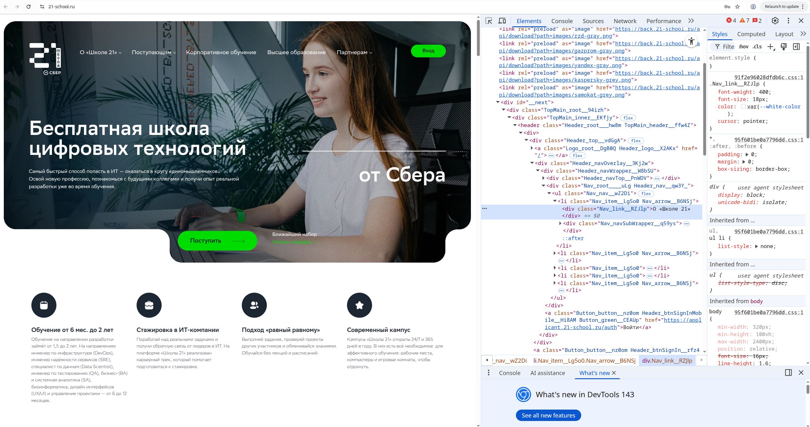
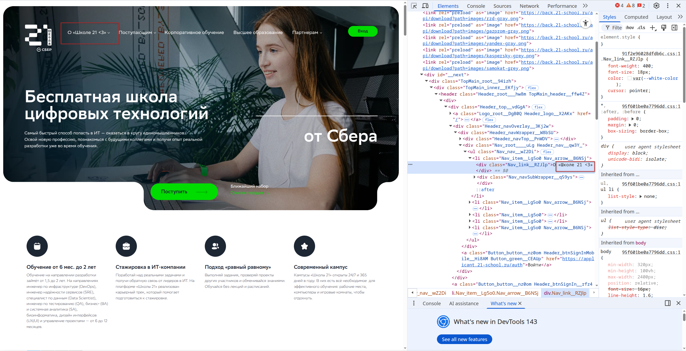
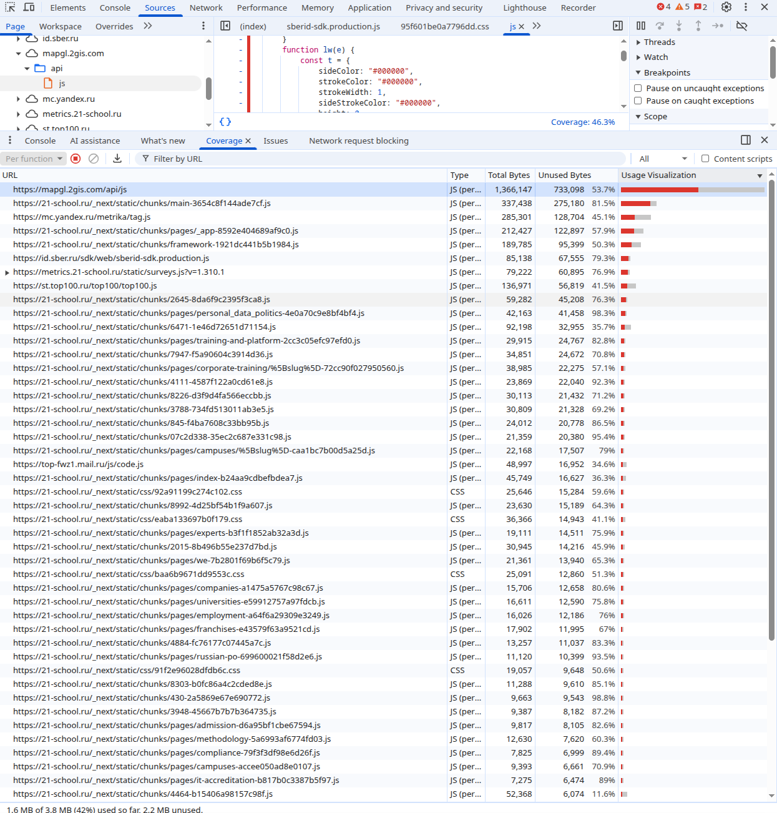
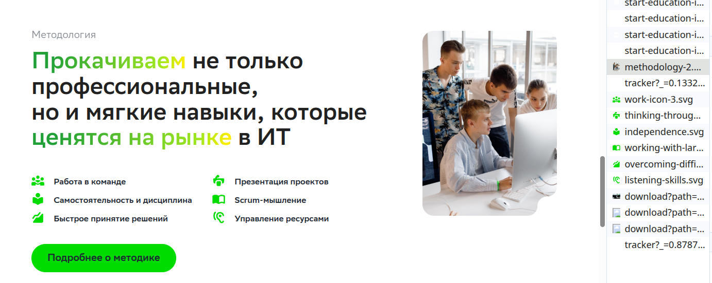
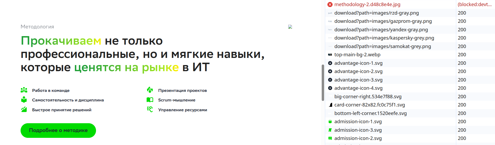

## Задание 2: Chrome DevTools

### Изменение любого раздела в хедере страницы

1. До изменения

2. После изменения

### Неиспользуемые CSS и JS в верстке

### Замеры скорости загрузки страницы

| Скорость | DOMContentLoaded | Load | Finish |
|:--------:|:----------------:|:----:|:------:|
|  Fast 4G | 2.18 s | 11.96 s | 22+ s|
| Slow 4G | 7.34 s | 1 min | 2.2+ min |
| 300 kbit/s | 30.64 s | 30.3 min | 37+ min |

__DOMContentLoaded__ - браузер скачал HTML, построил "скелет" страницы (DOM). Можно кликать по кнопкам и ссылкам, но каринки, шрифты и стили еще прогружаются.  
__Load__ - Все загружено (HTML, CSS, картинки, шрифты, скрипты).
__Finish__ - Загружены все картинки, шрифты, скрипты + ссылки.

### Блокировка картинки

1. Картинка до блокировки

2. Картинка после блокировки

