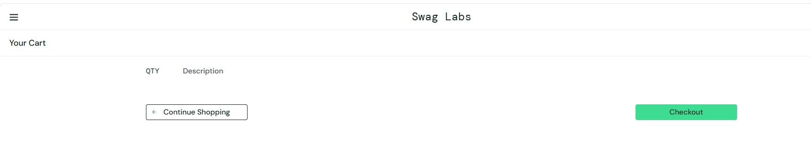
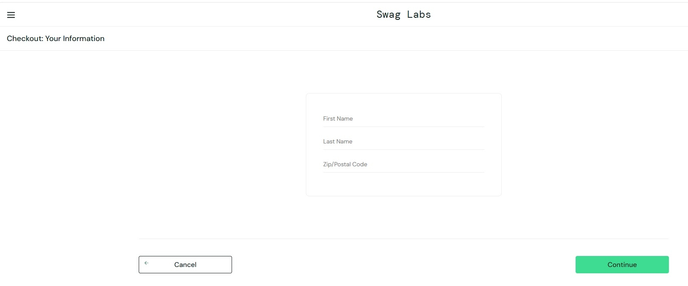

### № 1

__Заголовок:__ Кнопки "Remove" не меняются на "Add to cart" на странице каталога при сбросе состояния через "Reset App State"

__Серьезность:__ Minor

__Приоритет:__ Normal

__Предусловия:__  
1. Пользователь авторизован на сайте Swag Labs по URL: https://www.saucedemo.com/ под любым доступным аккаунтом(например: standard_user / secret_sauce).  
2. Открыта страница каталога товаров.

__Шаги воспроизведения:__ 
1. Выбрать 3-4 товара из каталога и нажать на кнопку "Add to cart" рядом с каждым из них.  
2. Нажать на кнопку меню (иконка с тремя полосками) в левом верхнем углу страницы.  
3. В открывшемся боковом меню нажать кнопку "Reset App State".

__Ожидаемый результат:__  
1. После нажатия на кнопку "Reset App State" в боком меню, состояние корзины сбрасывается, и иконка числа выбранных товаров исчезает.  
2. Все кнопки рядом выбранными товарами меняют свое состояние с "Remove" на "Add to cart".

__Фактический результат:__  
1. После нажатия на "Reset App State" состояние корзины сбрасывается: ранее добавленные товары удалены, индикатор количества товаров на иконке корзины исчезает.  
2. Все кнопки рядом с выбранными товарами не меняют свое состояние, что указывает на то, что продукт все ещё выбран, но его нет в корзине.

__Вложения:__

### № 2

__Заголовок:__ Кнопка "Checkout" на странице корзины работает при отсутствии товаров.

__Серьезность:__ Minor

__Приоритет:__ Normal

__Предусловия:__  
1. Пользователь авторизован на сайте Swag Labs по URL: https://www.saucedemo.com/ под любым доступным аккаунтом(например: standard_user / secret_sauce).  
2. Открыта страница каталога товаров.  
3. Корзина с товарами пуста.

__Шаги воспроизведения:__ 
1. Нажать на иконку корзины в правом верхнем углу страницы.  
2. На открывшейся странице "Your Cart" нажать на кнопку "Checkout".

__Ожидаемый результат:__  
1. Корзина пуста.  
2. При нажатии на кнопку "Checkout" редирект на страницу "Checkout: Your Information" не происходит. 
3. Появилось сообщение об ошибке "При оформлении заказа в корзине должен находиться хотя бы один товар".

__Фактический результат:__  
1. Корзина пуста, в ней отсутствуют товары.  
2. При нажатии на кнопку "Checkout" происходит переход на страницу оформления заказа.

__Вложения:__

Корзина пуста.

Баг - переход к оформлению заказа.

__Классификация бага: Minor__- Незначительный баг. На функционал системы влияет относительно мало, затрудняет использование дополнительных функций. Для обхода этого бага могут быть очевидные пути.

__Вид приоритета: Normal__ - Обычный приоритет, назначается по умолчанию. Эти баги устраняются во вторую очередь, в штатном порядке.
