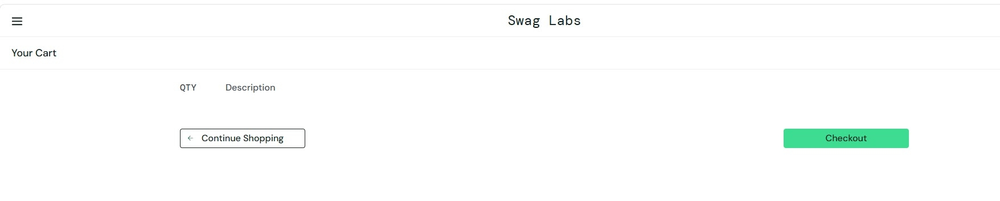
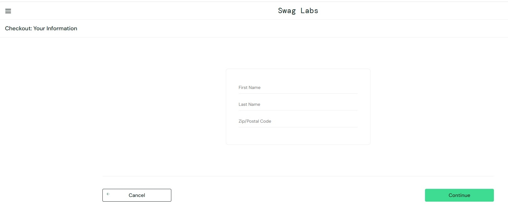
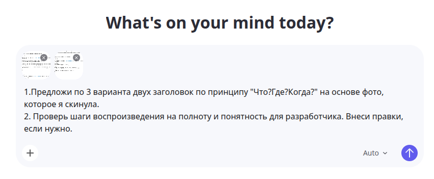

### Задание 3: Баг-репорт

### № 1

__Заголовок:__ Кнопки "Remove" не меняются на "Add to cart" на странице каталога при сбросе состояния через "Reset App State"

__Серьезность:__ Minor

__Приоритет:__ Normal

__Предусловия:__  
1. Пользователь авторизован на сайте Swag Labs по URL: https://www.saucedemo.com/ под любым доступным аккаунтом(например: standard_user / secret_sauce).  
2. Открыта страница каталога товаров.

__Шаги воспроизведения:__ 
1. Выбрать 3-4 товара из каталога и нажать на кнопку "Add to cart" рядом с каждым из них.  
2. Нажать на кнопку меню (иконка с тремя полосками) в левом верхнем углу страницы.  
3. В открывшемся боковом меню нажать кнопку "Reset App State".

__Ожидаемый результат:__  
1. После нажатия на кнопку "Reset App State" в боком меню, состояние корзины сбрасывается, и иконка числа выбранных товаров исчезает.  
2. Все кнопки рядом выбранными товарами меняют свое состояние с "Remove" на "Add to cart".

__Фактический результат:__  
1. После нажатия на "Reset App State" состояние корзины сбрасывается: ранее добавленные товары удалены, индикатор количества товаров на иконке корзины исчезает.  
2. Все кнопки рядом с выбранными товарами не меняют свое состояние, что указывает на то, что продукт все ещё выбран, но его нет в корзине.

__Вложения:__

### № 2

__Заголовок:__ Кнопка "Checkout" на странице корзины работает при отсутствии товаров.

__Серьезность:__ Minor

__Приоритет:__ Normal

__Предусловия:__  
1. Пользователь авторизован на сайте Swag Labs по URL: https://www.saucedemo.com/ под любым доступным аккаунтом(например: standard_user / secret_sauce).  
2. Открыта страница каталога товаров.  
3. Корзина с товарами пуста.

__Шаги воспроизведения:__ 
1. Нажать на иконку корзины в правом верхнем углу страницы.  
2. На открывшейся странице "Your Cart" нажать на кнопку "Checkout".

__Ожидаемый результат:__  
1. Корзина пуста.  
2. При нажатии на кнопку "Checkout" редирект на страницу "Checkout: Your Information" не происходит. 
3. Появилось сообщение об ошибке "При оформлении заказа в корзине должен находиться хотя бы один товар".

__Фактический результат:__  
1. Корзина пуста, в ней отсутствуют товары.  
2. При нажатии на кнопку "Checkout" происходит переход на страницу оформления заказа.

__Вложения:__

Корзина пуста.

Баг - переход к оформлению заказа.

__Классификация бага: Minor__- Незначительный баг. На функционал системы влияет относительно мало, затрудняет использование дополнительных функций. Для обхода этого бага могут быть очевидные пути.

__Вид приоритета: Normal__ - Обычный приоритет, назначается по умолчанию. Эти баги устраняются во вторую очередь, в штатном порядке.

### Отчет

Промпт для ИИ:

Было сгенерировано 6 вариантов заголовков(по 3 на каждый баг-репорт), которые соответствовали принципу "Что? Где? Когда?" для моих черновых вариантов заголовков. Проанализировав свои заголовки для первого и второго баг-репорта, я поняла, что они оба не соотвествуют заданному принципу. Поэтому я взяла варианты, которые предложила нейросеть, а именно, "Кнопки "Remove" не меняются на "Add to cart" на странице каталога при сбросе состояния через "Reset App State" и "Кнопка "Checkout" на странице корзины работает при отсутствии товаров".

Для баг-репорта № 1 нейросеть подсказала, что нужно конкретизировать шаги воспроизведения, поэтому я добавила пару словосочетаний. Однако, некоторые действия, которые должны находиться в пункте "Ожидаемый результат" нейросеть по непонятным причинам заключила в скобки и вставила в качестве "уточнения о визуальной вроверке после каждого действия". Это показалось мне неправильным, поэтому я не стала добавлять это в баг-репорт.

1) Обнаруженный дефект в баг-репорте 1 я считаю багом, так как кнопка "Reset App State" не выполняет полностью заявленную функцию и нарушает пользовательские ожидания от неё.

2) Гипотезы о возможных причинах возникновения дефекта:

- Разработчик забыл добавить код для визуального изменения кнопок при нажатии на "Reset App State". Т.е. он реализовал главную функцию очистки товаров корзины, но изменения кнопок с cостояния "Remove" на "Add to Cart" не были сделаны.

- Присутствует баг в коде, при котором заданная функция не выполняет своё назначение.

Предполагаемые точки исправления дефекта:

- Пройтись отладчиком по коду и в случае выявления места где система некорректно себя ведет, переписать логику.

- Добавить логику изменения статуса кнопки(в случае, если это является причиной бага)

3) Влияние дефекта:

| На пользователя | На бизнес-процессы |
|:----------------|:-------------------|
| 1. Подрыв доверия к странице, надежности ее системы и логики.   2. Общее снижения эстетического впечатления от продукта. | 1. Рост числа обращений в поддержку.   2. Пользователь покидает каталог товаров, не совершив покупку.   3. Репутационный риск - жалобы в отзывах на работу сайта. |

Для баг-репорта № 2 я не добавляла изменения в другие пункты, кроме заголовка. Нейросеть снова смешала пункт с шагами воспроизведения и ожидаемым результатом.

1) Обнаруженный дефект в баг-репорте 2 я считаю багом, так как неправильно реализованная логика нарушает основную бизнес-логику оформления заказа и может привести к сбоям.

2) Гипотезы о возможных причинах возникновения дефекта:

- В коде присутствует флаг(bool или int переменная), который меняет свое состояние, даже когда пользователь не выбирал товары в корзину. (При условии, что изначально bool flag = False. т.е. к оформлению заказа перейти было нельзя).

- Флаг в коде не меняет свое состояние и с самого начала был инициализирован как True. Т.е. с самого начала позволял оформлять заказ при отсутствии товаров в корзине.

Предполагаемые точки исправления дефекта:

- Пройтись отладчиком по коду и проверить сценарии, когда флаг может поменять свое значение. Исправить логику в случае выявления ошибки.

- Изначально отказать в оформлении заказа при отсутствии товаров и исправить значение флага на True при условии, что в корзине хотя бы один товар.

3) Влияние дефекта:

| На пользователя | На бизнес-процессы |
|:----------------|:-------------------|
| 1. Подрыв доверия к системе сайта и её корректной функциональности.   2. Недовольство логикой построения приложения, ощущение сырости и недобработанности. | 1. Репутационные риски - пользователь жалуется, что сайт некорректно работает, это может оттолкнуть потенциальных пользователей.   2. Создание "мусорных" заказов в системе. Может произойти сбой в складских или логических процессах.   3. "Мусорные" заказы искажают данные, которые менеджеры и аналитики могут использовать для отчетности. |

