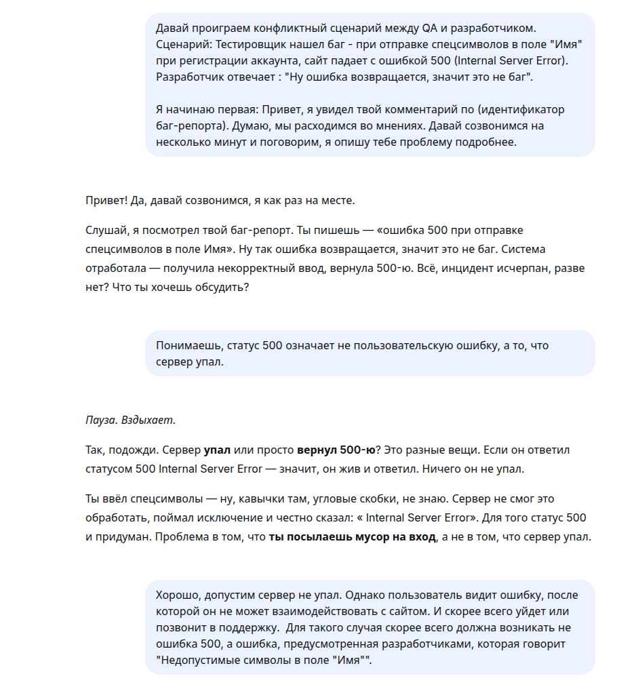
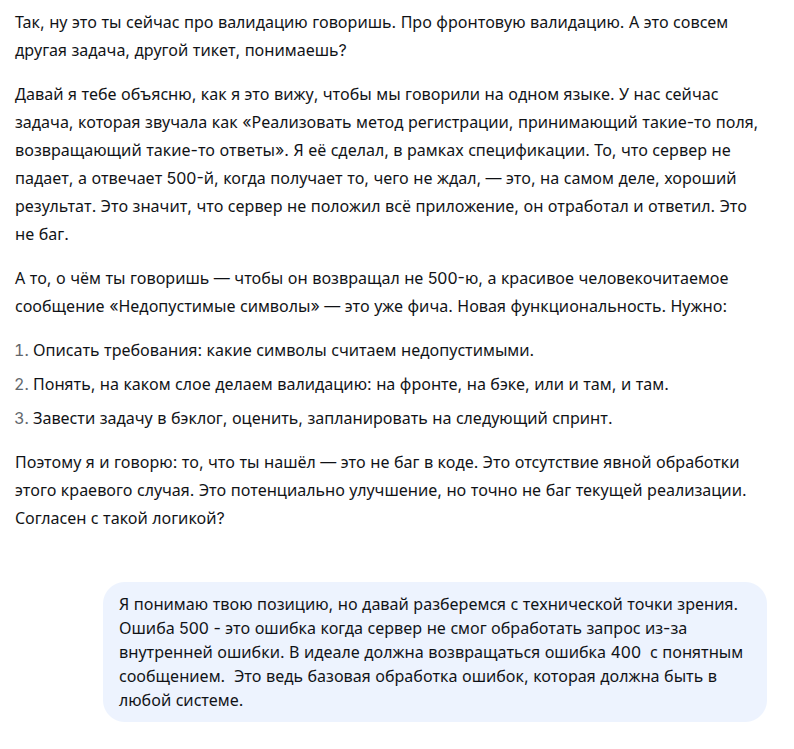
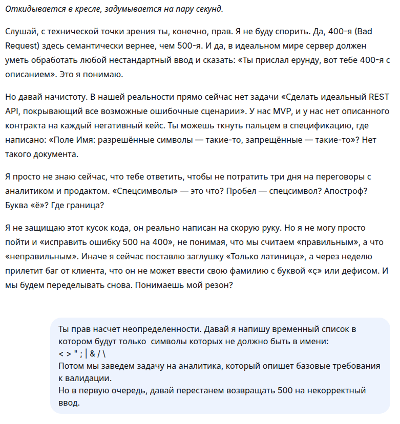
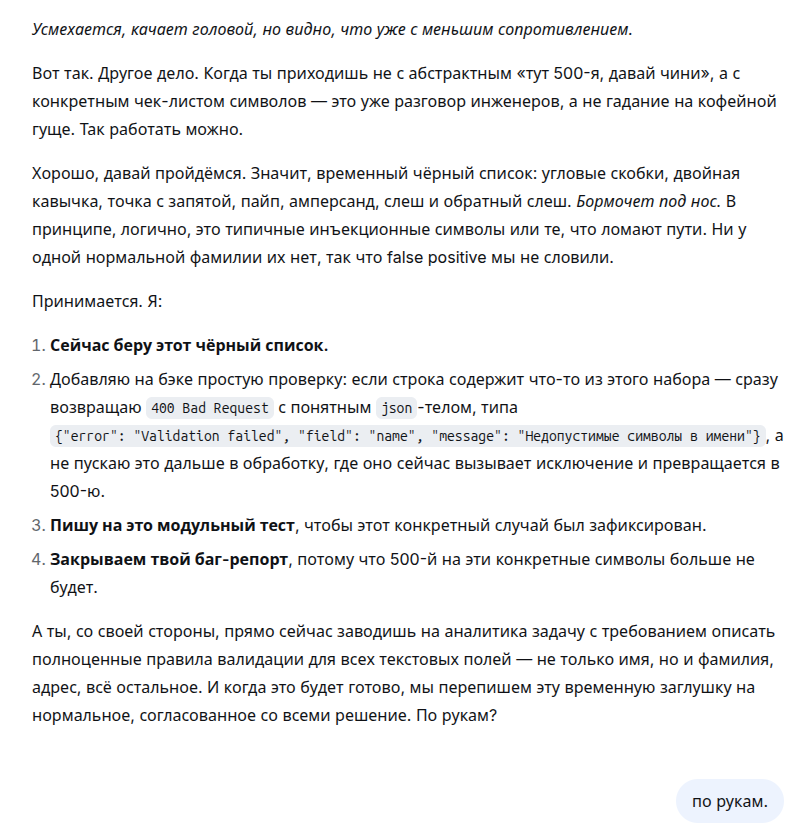

### Задание 4: жизненный цикл баг-репорта.

| Этап / статус жизненного цикла баг-репорта | Что происходит | Кто и на каком этапе может менять статус баг-репорта | Пример |
|:-------------------------------------------|:---------------|:-----------------------------------------------------|:-------|
| "New" | Дефект создан, но в работу еще не отправлен (возможно, тестировщик уточняет какие-либо детали для данного дефекта) | Статус выставляется автоматически | Тестировщик при проверке сайта магазина замечает, что в имя пользователя можно вписать специальные символы ( /,[,]) и создает баг-репорт. |
| "Open" | Разработчик получает баг-репорт, приступает к его анализу. | Статус выставляется разработчиком, когда он приступает к рассмотрению баг-репорта. | Разработчик открыл поступивший баг-репорт и приступил к проверке, действительно ли ошибка в валидации поля. |
| "Dublicate" | Когда дефект повторяется дважды или соответствует концепции другого бага, ему присваивается статус "Дубликат". | Разработчик, тимлид или менеджер на этапе анализа бага. | Тимлид находит идентичный отчет, сделанный пару недель назад на эту тему и ставит статус "Дубликат". |
| "Assigned" | Баг-репорт просмотрен и признан нуждающимся в исправлении. | Тимлид или менеджер после анализа и подтверждения бага. | Рассмотренный баг менеджер назначает на конкретного backend-разработчика. |
| "In progress" |  Баг находится в процессе исправления командой разработки. | Команда разработки, когда приступила к исправлению бага. | Разработчик исправляет логику работы сайта(отклонение специальных символов) в коде валидации поля имени. |
| "Rejected" | Если команда разработки или руководитель в процессе посчитали, что дефект не требует исправления, то он отклонен. | Разработчик, тимлид, руководитель после анализа. | Были уточнены требования у заказчика и выяснилось, что имя пользователя может содержать специальные символы. |
| "Deferred" | Если есть баг-репорты с более высоким приоритетом и существующий баг можно исправить в следущем релизе, то ему присваивается статус "Отложен." | Менеджер проекта при приортизации всех баг-репортов. | Менеджер посчитал, что ошибка ввода специальных символов в поле встречается довольно редко, поэтому решил перенести баг на следующий релиз и заняться исправлением более приоритетных багов. |
| "Fixed" | Разработчик внес необходимые правки для исправления дефекта. | Разработчик после успешного исправления бага. | Разработчик исправил баг и закоммитил его. |
| "Closed" | Баг был устранен и его больше не существует. Ему присваивается статус "Закрыт". | Тестировщие или менеджер проекта после проверки наличия бага. | Тестировщик проверил, что баг действительно был исправлен, теперь при вводе специальных символов, на экране появляется ошибка "Недопустимые символы". |

#### Конфликтные сценарии
#### № 1 : Разработчик говорит "Not a bug".

__Контекст:__ Тестировщик нашел баг - при отправке спецсимволов в поле "Имя" при регистрации аккаунта, сайт падает с ошибкой 500 (Internal Server Error). Разработчик отвечает : "Ну ошибка возвращается, значит это не баг".

__Действия:__

1) Перепроверить требования, действительно ли баг НЕ является артефактом своего локального окружения и НЕ вызван специфическими особенностями рабочей среды.

2) Если баг действительно есть, но разработчик не признает его, то нужно собрать доказательную базу. Т.е. воспроизвести её заново и зафиксировать (видео/скриншоты/). Конкретнее: на видео внести в поле "Имя" на странице регистрации сайта специальные символы, такие как [,]\'/. Показать воспроизведения ошибки 500.

3) В первую очередь, не нужно обвинять разработчика в непонимании ситуации, а предложить созвониться/поговорить лично. Возможно, в сообщении стоит написать: "Привет, я увидел твой комментарий по (идентификатор баг-репорта). Думаю, мы расходимся во мнениях. Давай созвонимся на несколько минут и поговорим, я опишу тебе проблему подробнее."

4) Созвонившись с разработчиком важно не активно спорить с ним и доказывать свою правоту(это испортит отношения с командой разработки), важно услышать причины отказа. Они могут быть такими:  
*Разработчик не понял что именно падает*.  
*Он не хочет чинить баг, так как это нудно или сложно*.  
*Он считает что пользователь не пойдет по такому сценарию*.

5) Объяснить в чем заключается проблема. Для нескольких ситуаций могут быть разные аргументы:   
*Разработчик не понял что именно падает*.  
Возможно, разработчик не различает контролируемую ошибку и неконтролируемое падение системы. Зная это, нужно донести ему, что ошибка 500, это не сбой для пользователя, а сбой в системе. Пользователь видит лишь неработающий сайт.  
"Смотри, я включил демонстрацию экрана. Сейчас я введу этот запрос(*ввод недопустимых значений в поле*) и мы увидим, что происходит с сайтом. Видишь статус 500? Это значит что сервер вывел необработанную ошибку, а ошибку с отклонением запроса."  
*Он не хочет чинить баг, так как это нудно или сложно*.  
Думаю, лучше всего будет донести последствия бездействия.  
"Лучше всего потратить время на исправление этого бага. Ведь если его намеренно игнорировать, может быть хуже. Клиент не пойдет разбираться - он просто уйдет. А если не уйдет, то позвонит в поддержку. И тогда на этот баг уже буду обращать внимание не я, а руководитель."  
*Он считает что пользователь не пойдет по такому сценарию*  
Разработчик смотрит на систему изнутри и может судить так, как поступил бы "правильный" пользователь. Но пользователи не читают документаци, тем более злоумышленники.  
"Понимаешь, пользователь не обязан быть правильным. Они действуют как захотят, они могут вставлять эмодзи, копировать символы и т.д. Если система падает от такой мелочи - она не надежна."

6) Если после приведения аргументов разработчик все равно не поменял свое мнение, следует привлечь тимлида. Важно не жаловаться, а структурировать проблему.  
Если же разработчик согласился, следует задокументировать решение.

#### № 2 : Баг не воспроизводится на среде у разработчика.

__Контекст:__ Тестировщик нашел баг - на сайте конвертации файла из docx в pdf формат при загрузке файла размером 25МБ и больше приложение виснет, и вкладка не отвечает. Разработчик отвечает: "У меня не воспроизводится. Загрузил docx на 30Мб и все конвертируется, вкладка не виснет."

__Действия:__

1) Прежде чем идти к разработчику можно порассуждать по каким причинам баг у разработчика может не воспроизводиться:

| Причина | QA | Разработчик |
|:--------|:---|:------------|
| Разный URL среды. | convert.com | localhost:3000 |
| Разные браузеры.  | Microsoft Edge | Chrome |
| Разные версии кода | QA по ошибке может тестировать на старом коде с прошлого релиза | Разработчик работает с измененным кодом |
| Разные роли | Тестировщик проверяет сценарий от лица пользователя без платной подписки | Разработчик проверил под ролью администратора с учетной записью с полным доступом |

2) В первичном ответе разработчику в первую очередь следует предложить встречу или созвон, чтобы вместе разобраться в чем различаются окружения.  
"Привет, я увидел твой комментарий по (идентификатор баг-репорта). Давай созвонимся, я покажу проблему на своем окружении. Раз у тебя не воспроизводится, возможно причина на уровне окружения. Давай посмотрим где у нас расхождения."

3) На самом созвоне все свои действия следует комментировать: какой браузер, под каким юзером заходишь, куда нажимаешь.

4) Если совместный просмотр не дал ответа, следует найти конкретное различие между окружениями. Возможные расхождения описаны в таблице выше.

5) Существует вариант, когда разработчик считает, что если у него все работает, значит бага нет. В такой ситуации следует пояснить, что у пользователей может быть не так:  
"Я понимаю, что у тебя все работает. Но давай подумаем, у тебя локальная среда с идеальными данными и быстрым интернетом. А у пользователя может быть медленный интернет, старый браузер и т.д. Давай  я покажу тебе как работает программа в реальных условиях."

6) Шаг совпадает с шагом 6 в конфликтном сценарии № 1.  
Если после приведения аргументов разработчик все равно не поменял свое мнение, следует привлечь тимлида. Важно не жаловаться, а структурировать проблему.  
Если же разработчик согласился, следует задокументировать решение.

#### Конфликтный сценарий с ИИ

