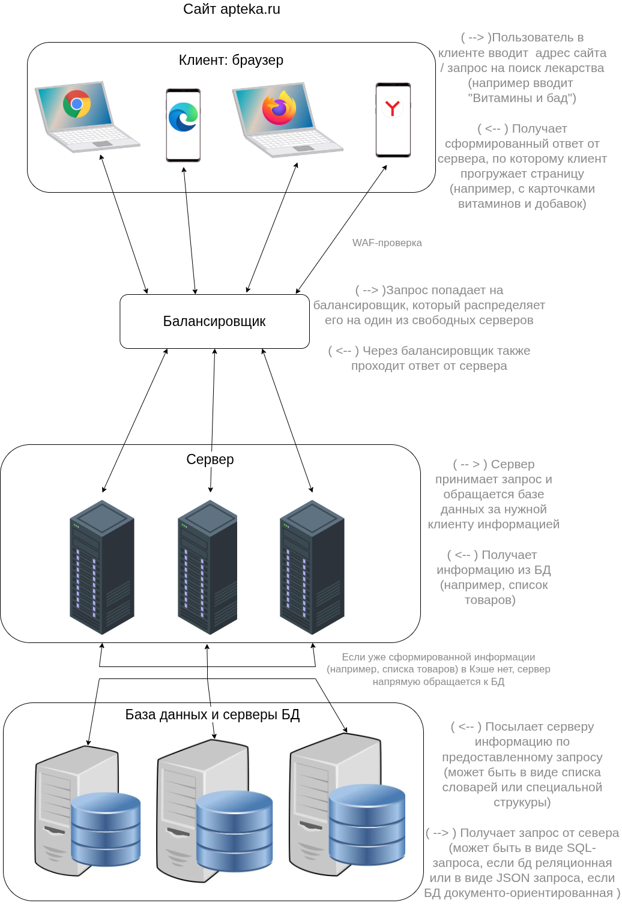

## Задание 1: Клиент-серверная архитектура

### Примерная блок-схема архитектуры сайта apteka.ru ( моё видение )

| Компонент архитектуры | 1-2 наиболее вероятных типа сбоя для этого компонента | Как этот сбой проявляется для конечного пользователя | Тип нефункц. тестирования, который наиболее релевантен для проверки устойчивости системы к данному сбою |
|:----------------------|:------------------------------------------------------|:-----------------------------------------------------|:--------------------------------------------------------------------------------------------------------|
| Балансировщик | 1. Сетевой сбой - нарушение распределения трафика между серверами. Балансировщик теряет связь либо с клиентами, либо с серверной частью.   2. Аппаратный сбой - выход из строя самого балансировщика (экстремальный сетевой трафик, износ компонентов).| Сайт или приложение перестает быть доступным для всех пользователей, даже если серверы и БД работают идеально. Либо сайт работает медленнее обычного и иногда падает с ошибками. | *Для 1-2.* Тестирование отказоустойчивости - создаются аварийные ситуации для проверки как система себя поведет.   *Для 2.* Стресс-тестирование - помогает узнать, при каком экстремальном объеме трафика балансировщик начнет перегреваться, аварийно завершать работу и т.д |
| База данных и серверы БД | 1. Проблема параллельного доступа к данным - когда две транзакции одновременно пытаются работать с одними и теми же данными, могут мешать друг другу.   2. Переполнение диска с БД. | 1.1. Пользователи получат неверные данные.   1.2. Пользователи начнут получать ошибки при сохранении заказов.   2.Пользователи начнут получать ошибки при сохранении заказов. | *Для 1.* Конкурентное тестирование - проверка стабильности БД при одновременном доступе (изменяются уровни изоляции в БД).   *Для 2.* Тестирование производительности - проверка работы системы при предельных объемах данных. |

| Параметры сравнения | "Холодный" резерв | "Горячий" резерв |
|:--------------------|:------------------|:-----------------|
| Готовность | Работает в минимальном режиме / выключен или заказывается и настраивается уже после возникновения аварии, данные переносятся. | Всегда включен, запущены все необходимые сервисы. В любой момент готов к приему нагрузки. |
| Синхронизация данных | Перед стартом нужно разворачивать ПО и данные. Данные на резервном сервере устаревшие , а обновление происходит только в момент создания резервной копии. | Непрерывная (т.к. данные синхронизируются постоянно через репликацию БД, состояния).|
| Время переключения | Долгое (часы / сутки)| Мгновенное (автоматическое) - секунды / доли секунды. |
| Стоимость | Минимальная (т.к. нужно оплатить только хранилище для резервных копий и сам сервер на складе).| Высокая (т.к. требует мощного оборудования, оплата постоянных затрат на электричество и охлаждение). |
| Плюсы | - Низкая стоимость.   - Низкое энергопотребление.   - Простота поддержки. | - Нет потери данных.   - Автоматическое переключение при аварии.   - Пользователь практически не замечает сбой. |
| Минусы | - Потеря данных при аварии и восстановление старой версии.   - Долгое включение и настройка перед использованием. | - Высокая стоимость содержания.   - Сложность настройки.   - Высокие энергозатраты.  |

__Репликация__ - копирование данных с одного сервера БД (или сервера приложений) на другой.

### Сценарий теста

__Компонент:__ База данных (БД).

__Название:__ Переключение на резервную копию БД при отказе основной.

__Описание:__ Проверка перевода резервной БД в статус основного при сбое главного сервера : оценка RTO и RPO.

__Отслеживаемые метрики:__   
__RTO (Recovery Time Objective)__ - целевое время восстановления.  
__RPO (ecovery Point Objective)__ - целевая точка восстановления (макс. объем данных, который бизнес может потерять в результате сбоя).

__Предусловия:__ Развернуты два сервера БД: основной и резервный. Основная БД работает в режиме архивирования журналов транзакций. Резервная БД работает в специальном режиме постоянного восстановления с архивированных журналов, получаемых от основной БД. Тестовая таблица 'testing_table' создана на основном сервере.

__Шаг 1: Запуск нагрузки__

- На основном сервере БД запустить скрипт бесконечной вставки строк в таблицу. Каждая строка имеет порядковый номер ('num NUMBER'), время добавления ('insert_time TIMESTAMP') и имя сервера ('server_name VARCHAR(20)'). Каждая такая транзакция завершается коммитом.

__Шаг 2: Проверка синхронизации перед сбоем__

- Убедиться, что данные, вставляемые на основном сервере, поступают на резервный. Для этого на резервном вервере выполнить запрос количества строк в тестовой таблице.

SELECT COUNT(*) AS rw_count  
FROM testing_table;

__Шаг 3: Принудительное выключение основного сервера БД__

- Выполнить отключение основного сервера (иммитация аппаратного сбоя или пропажи питания).

- Зафиксировать время момента сбоя по последней успешной записи.

__Шаг 4: Перевод резервного сервера в статус основного__

- _Если настроено автоматическое переключение:_ дождаться, пока система зафиксирует таймаут основного сервера и переключится на резервный.

- _Если предполагается ручное переключение:_ подать на резервный сервер команду для выхода из режима восстановления архивированных журналов, и переключение на режим чтения и записи.

- Зафиксировать время переключения.

- Вычислить RTO: время переключения - время сбоя.

__Ожидаемый результат:__

- На шаге 2 количество строк в табличке резервного БД возрастает синхронно со строками основного БД. Последний порядковый номер (MAX(num)) совпадает с основным.

- На шаге 3 основной сервер БД недоступен. Скрипт нагрузки остановлен. Зафиксировано время сбоя.

- На шаге 4 резервный сервер переведен в роль Master/Primary. Время переключения зафиксировано. Нагрузка направлена на новый основной сервер и возобновила вставку. В строке server_name содержит в себе имя бывшего резервного сервера.

- Последний порядковый номер (MAX(num)) до сбоя соответствует последнему номру в таблице 'testing_table' на новом основном сервере после переключения (RPO = 0).

- RTO не превышает установленного лимита.

